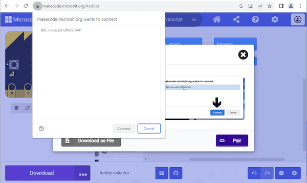

Για να εκτελέσεις το πρόγραμμά σου στο φυσικό σου micro:bit, θα χρειαστεί να κατεβάσεις το αρχείο του προγράμματος σε αυτό.

Κάνε κλικ στο κουμπί **Λήψη** κάτω από τον προσομοιωτή micro:bit.

Θα σου ζητηθεί να συνδέσεις το micro:bit. Επίλεξε τη γλώσσα σου και κάνε κλικ στο **Συνέχεια**.

Κάνε κλικ στο **Pair** και επίλεξε τη συσκευή σου από τη λίστα που εμφανίζεται και, στη συνέχεια, κάνε κλικ στο **Connect**.

**Εντοπισμός σφαλμάτων:** Το micro:bit μου δεν θα κάνει ζεύξη

Εάν το micro:bit σου δεν εμφανίζεται, δοκίμασε να το αποσυνδέσεις και να το συνδέσεις ξανά. Μπορείς επίσης να δοκιμάσεις μια διαφορετική θύρα USB ή καλώδιο USB εάν είναι διαθέσιμα.

Εάν το micro:bit σου δεν πραγματοποιεί ζεύξη, μπορείς να χρησιμοποιήσεις το κουμπί **Λήψη** για να πραγματοποιήσεις λήψη του προγράμματός σου ως αρχείο `.HEX`. Στη συνέχεια, μπορείς να μεταφέρεις το πρόγραμμα στο micro:bit χρησιμοποιώντας το σύστημα αρχείων του υπολογιστή σου.

**Windows:** Άνοιξε **Αναζήτηση** και έλεγξε ότι μπορείς να δεις `MICROBIT` κάτω από `Αυτός ο υπολογιστής` στην αριστερή πλευρά. Εάν υπάρχει, σύρε το αρχείο `.HEX` που κατέβασες σε αυτό, το πρόγραμμά σου θα αποθηκευτεί στο micro:bit και θα μπορείς να το χρησιμοποιήσεις.

**macOS:** Άνοιξε **Finder** και έλεγξε ότι μπορείς να δεις `MICROBIT` κάτω από `Locations` στην αριστερή πλευρά. Εάν υπάρχει, σύρε το αρχείο `.HEX` που κατέβασες σε αυτό, το πρόγραμμά σου θα αποθηκευτεί στο micro:bit και θα μπορείς να το χρησιμοποιήσεις.
