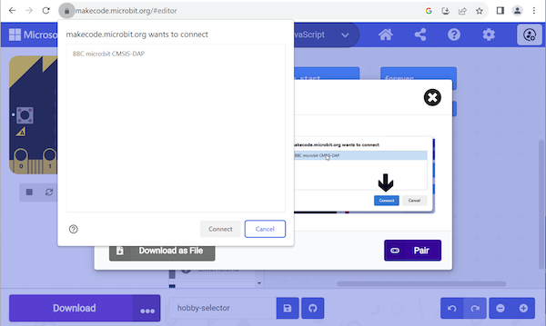

プログラムをmicro:bit本体で実行するには、プログラムファイルをmicro:bit本体にダウンロードする必要があります。

micro:bitシミュレーターの下にある**ダウンロード**ボタンをクリックします。

micro:bitを接続するように求められます。 今すぐ実行し、 **次へ** をクリックします。

**ペアリング** をクリックし、表示されたリストからデバイスを選択し、 **接続**をクリックします。

**デバッグ:** micro:bitがペアリングできません

micro:bitが認識されない場合は、一度電源プラグを抜いてから再度差し込んでみてください。 可能であれば、別のUSBポートやUSBケーブルを試してみてください。

micro:bitがペアリングされない場合は、 **ダウンロード** ボタンを使用して、プログラムを `.HEX` ファイルとしてダウンロードできます。 その後、ファイルシステムを使用してプログラムをmicro:bitに移動できます。

**Windows:**** ファイルエクスプローラー **を開き、 左側の `この PC` の下に `MICROBIT` が表示されていることを確認します。 もしあれば、ダウンロードした`.HEX`ファイルをそこにドラッグすると、プログラムがmicro:bitに保存され、使用できるようになります。

**macOS:** **Finder**を開き、左側の`場所`の下に`MICROBIT` が表示されていることを確認します。 もしあれば、ダウンロードした`.HEX`ファイルをそこにドラッグすると、プログラムがmicro:bitに保存され、使用できるようになります。
