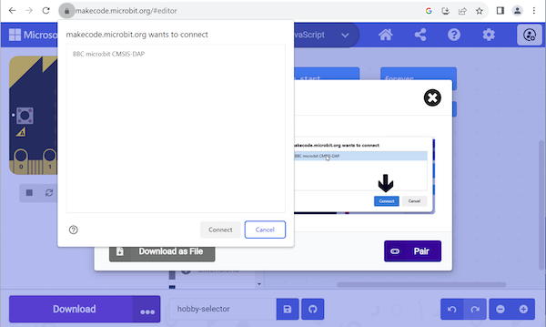

Om je programma uit te voeren op je micro:bit, moet je je programma bestand er naar downloaden.

Click the **Download** button below the micro:bit simulator.

Er wordt gevraagd om je micro:bit aan te sluiten. Sluit je micro: bit aan, klik dan op **Klaar**.

Klik op **Koppelen** en selecteer je apparaat uit de lijst die verschijnt, en klik daarna op **Verbinden**.

**Foutopsporing:** Mijn micro:bit koppelt niet

Als je micro:bit niet verschijnt, probeer hem dan los te koppelen en opnieuw aan te sluiten. Je kunt ook een andere USB-poort of USB-kabel uitproberen als deze beschikbaar zijn.

Als je micro:bit niet koppelt kan je de **Downloaden** knop gebruiken om je programma te downloaden als een `.HEX` bestand. Je kunt het programma dan met behulp van je bestandssysteem naar je micro:bit verplaatsen.

**Windows:** Open **File Explorer** and check that you can see `MICROBIT` under `This PC` on the left-hand side. Als je micro:bit erbij staat, sleep dan het gedownloade `.HEX`-bestand ernaartoe, je programma zal worden opgeslagen op je micro:bit en je zou het moeten kunnen gebruiken.

**macOS:** Open **Finder** and check that you can see `MICROBIT` under `Locations` on the left-hand side. Als je micro:bit erbij staat, sleep dan het gedownloade `.HEX`-bestand erbij, je programma zal worden opgeslagen op je micro:bit en je zou het moeten kunnen gebruiken.
